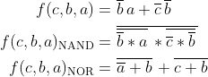

```LaTeX
\begin{align*}
    f(c,b,a) =&~ \overline{b}\,a + \overline{c}\,\overline{b}\\
    f(c,b,a)_{\textup{NAND}} =&~ \overline{\overline{\overline{b}*a}\,*\overline{\overline{c}*\overline{b}}\,}\\
    f(c,b,a)_{\textup{NOR}} =&~ \overline{\overline{a}+b}\,+\overline{c+b}\,\\
\end{align*}
```
>
| **c** | **b** |**a** | **f(c,b,a)** |
| :-: | :-: | :-: | :-: |
| 0 | 0 | 0 | 1 |
| 0 | 0 | 1 | 1 |
| 0 | 1 | 0 | 0 |
| 0 | 1 | 1 | 0 |
| 1 | 0 | 0 | 0 |
| 1 | 0 | 1 | 1 |
| 1 | 1 | 0 | 0 |
| 1 | 1 | 1 | 0 |
