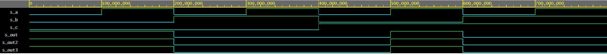
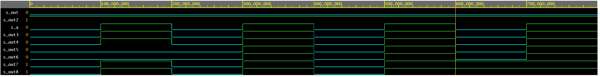

Odkaz do github repozitáře Digital electronics-1
https://github.com/Krakenuz/Digital-electronics-1

## De Morganovy zákony

### Odkaz na Playground se kterým jsem ověřil výsledky
https://www.edaplayground.com/x/Mj8F
### Screenshot ze simulátoru

| **c** | **b** |**a** | **f(c,b,a)** |
| :-: | :-: | :-: | :-: |
| 0 | 0 | 0 | 1 |
| 0 | 0 | 1 | 1 |
| 0 | 1 | 0 | 0 |
| 0 | 1 | 1 | 0 |
| 1 | 0 | 0 | 0 |
| 1 | 0 | 1 | 1 |
| 1 | 1 | 0 | 0 |
| 1 | 1 | 1 | 0 |

## Ověření Distributivních zákonů

### Screenshot ze simulátoru

### Odkaz na Playground se kterým jsem ověřil výsledky
https://www.edaplayground.com/x/tbBn

#### VHD Soubory se nachází v github adresáři.
