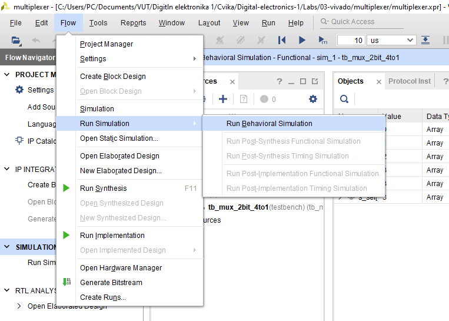

Odkaz na github: https://github.com/Krakenuz/Digital-electronics-1/tree/main/Labs/
## Preparation tasks
### SWITCH table
| **Switch name** | **FPGA pin** | **FPGA package pin** |
| :-: | :-: | :-: |
| SW[0] | IO_L24N_T3_RS0_15 |  J15 |
| SW[1] | IO_L3N_T0_DQS_EMCCLK_14 |  L16 |
| SW[2] | IO_L6N_T0_D08_VREF_14 |  M13 |
| SW[3] | IO_L13N_T2_MRCC_14 |  R15 |
| SW[4] | IO_L12N_T1_MRCC_14 |  R17 |
| SW[5] | IO_L7N_T1_D10_14 |  T18 |
| SW[6] | IO_L17N_T2_A13_D29_14 |  U18 |
| SW[7] | IO_L5N_T0_D07_14 |  R13 |
| SW[8] | IO_L24N_T3_34 |  T8 |
| SW[9] | IO_25_34 |  U8 |
| SW[10] | IO_L15P_T2_DQS_RDWR_B_14 |  R16 |
| SW[11] | IO_L23P_T3_A03_D19_14 |  T13 |
| SW[12] | IO_L24P_T3_35 |  H6 |
| SW[13] | IO_L20P_T3_A08_D24_14 |  U12 |
| SW[14] | IO_L19N_T3_A09_D25_VREF_14 |  U11 |
| SW[15] | IO_L21P_T3_DQS_14 |  V10 |

### LED table
| **LED Name** | **FPGA pin** | **FPGA package pin name** |
| :-: | :-: | :-: |
| LED[0] | IO_L18P_T2_A24_15 |  H17 |
| LED[1] | IO_L24P_T3_RS1_15 |  K15 |
| LED[2] | IO_L17N_T2_A25_15 |  J13 |
| LED[3] | IO_L8P_T1_D11_14 |  N14 |
| LED[4] | IO_L7P_T1_D09_14 |  R18 |
| LED[5] | IO_L18N_T2_A11_D27_14 |  V17 |
| LED[6] | IO_L17P_T2_A14_D30_14 |  U17 |
| LED[7] | IO_L18P_T2_A12_D28_14 |  U16 |
| LED[8] | IO_L16N_T2_A15_D31_14 |  V16 |
| LED[9] | IO_L14N_T2_SRCC_14 |  T15 |
| LED[10] | IO_L22P_T3_A05_D21_14 |  U14 |
| LED[11] | IO_L15N_T2_DQS_DOUT_CSO_B_14 |  T16 |
| LED[12] | IO_L16P_T2_CSI_B_14 |  V15 |
| LED[13] | IO_L22N_T3_A04_D20_14 |  V14 |
| LED[14] | IO_L20N_T3_A07_D23_14 |  V12 |
| LED[15] | IO_L21N_T3_DQS_A06_D22_14 |  V11 |

## Two-bit wide 4-to-1 multiplexer
### VHDL architecture
```vhdl
architecture Behavioral of mux_2bit_4to1 is
begin
f_o <= a_i when (sel_i = "00" ) else
              b_i when (sel_i = "01" ) else
              c_i when (sel_i = "10" ) else
              d_i when (sel_i = "11" );

end Behavioral;
```
### VHDL stimulus process
```vhdl
p_stimulus : process
begin

    report "Stimulus process started" severity note;
    s_a <= "00"; s_b <= "11"; s_c <= "11"; s_d <= "11";
    s_sel <= "00"; wait for 100 ns;
    
    s_a <= "11"; s_b <= "01"; s_c <= "11"; s_d <= "11";
    s_sel <= "01"; wait for 100 ns;
    
    s_a <= "11"; s_b <= "11"; s_c <= "10"; s_d <= "11";
    s_sel <= "10"; wait for 100 ns;
    
    s_a <= "00"; s_b <= "01"; s_c <= "10"; s_d <= "11";
    s_sel <= "11"; wait for 100 ns;
    report "Stimulus process finished" severity note;
        wait;
    end process p_stimulus;
```
### Simulated waveforms

## Vivado tutorial
__Create new project__

__Click next__

__Write name of project__

__Choose RTL Project and click next__

__Create VHDL files__

__After creating vhdl files click next

__Add nexys constraint XDC file__

__Choose Nexys Board__

__Click finish__


__Define inputs and outputs__


__After writing VHDL files run simulation__

