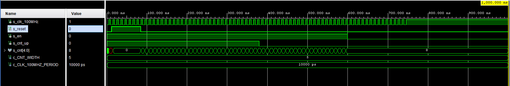
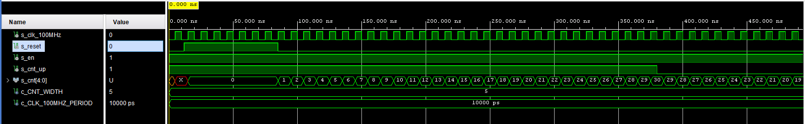

## 1. Preparation tasks

### Connection of buttons

| **Button** | **FPGA pin** | **FPGA package pin** |
| :-: | :-: | :-: |
| BTNC | IO_L9P_T1_DQS_14 | N17 |
| BTNU | IO_L4N_T0_D05_14 | M18 |
| BTNL | IO_L12P_T1_MRCC_14 | P17 |
| BTNR | IO_L10N_T1_D15_14 | M17 |
| BTND | IO_L9N_T1_DQS_D13_14 | P18 |


   | **Time interval** | **Number of clk periods** | **Number of clk periods in hex** | **Number of clk periods in binary** |
   | :-: | :-: | :-: | :-: |
   | 2&nbsp;ms | 200 000 | `x"3_0d40"` | `b"0011_0000_1101_0100_0000"` |
   | 4&nbsp;ms | 400 000 | `x"6_1a80"` | `b"0110_0001_1010_1000_0000"` |
   | 10&nbsp;ms | 1 000 000 | `x"f_4240"` | `b"1111_0100_0010_0100_0000"` |
   | 250&nbsp;ms | 25 000 000 | `x"17d_7840"` | `b"0001_0111_1101_0111_1000_0100_0000"` |
   | 500&nbsp;ms | 50 000 000 | `x"2fa_f080"` | `b"0010_1111_1010_1111_0000_1000_0000"` |
   | 1&nbsp;sec | 100 000 000 | `x"5f5_e100"` | `b"0101_1111_0101_1110_0001_0000_0000"` |
   
##Bidirectional counter
### Process p_cnt_up_down VHDL code
```vhdl
p_cnt_up_down : process(clk)
    begin
        if rising_edge(clk) then
        
            if (reset = '1') then               -- Synchronous reset
                s_cnt_local <= (others => '0'); -- Clear all bits

            elsif (en_i = '1') then       -- Test if counter is enabled


                -- TEST COUNTER DIRECTION HERE
				
				if (cnt_up_i = '1') then
                s_cnt_local <= s_cnt_local + 1;
				else
				s_cnt_local <= s_cnt_local - 1;
				end if;
            end if;
        end if;
    end process p_cnt_up_down;
```
### Reset and stimulus process VHDL code
```vhdl
 --------------------------------------------------------------------
    -- Reset generation process
    --------------------------------------------------------------------
    p_reset_gen : process
    begin
        s_reset <= '0';
        wait for 28 ns;
        
        -- Reset activated
        s_reset <= '1';
        wait for 153 ns;

        -- Reset deactivated
        s_reset <= '0';

        wait;
    end process p_reset_gen;
	
	 --------------------------------------------------------------------
    -- Data generation process
    --------------------------------------------------------------------
    p_stimulus : process
    begin
        report "Stimulus process started" severity note;

        report "Stimulus process finished" severity note;
        wait;
    end process p_stimulus;
```

### Simulated time waveforms



