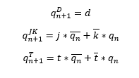
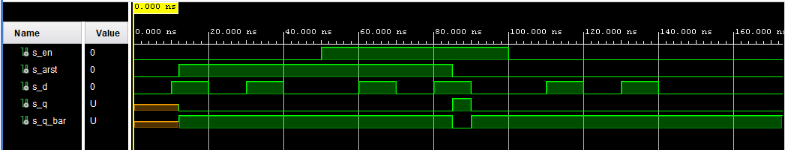
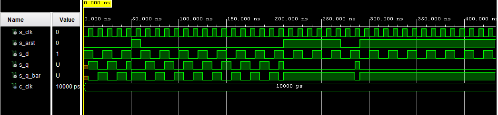
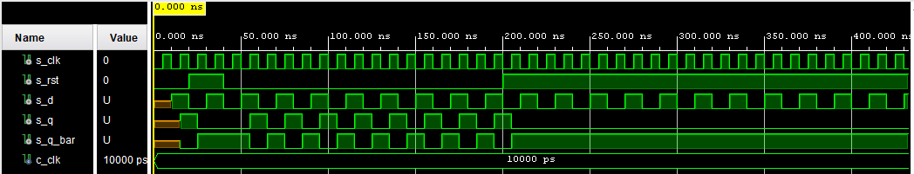
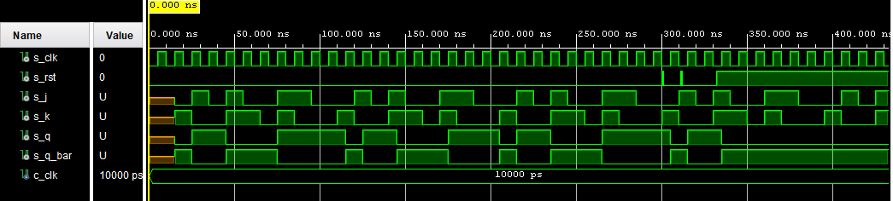
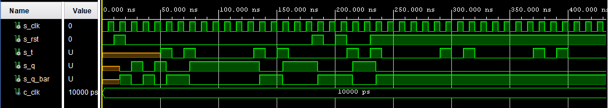
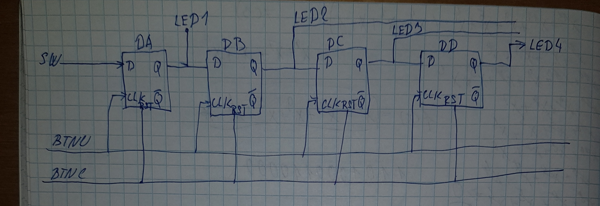

## Preparation tasks


| **clk** | **d** | **q(n)** | **q(n+1)** | **Comments** |
| :-: | :-: | :-: | :-: | :-- |
| ↑ | 0 | 0 | 0 | d na vystup |
| ↑ | 0 | 1 | 0 | d na vystup |
| ↑ | 1 | 0 | 1 | d na vystup |
| ↑ | 1 | 1 | 1 | d na vystup |

| **clk** | **j** | **k** | **q(n)** | **q(n+1)** | **Comments** |
   | :-: | :-: | :-: | :-: | :-: | :-- |
   | ↑ | 0 | 0 | 0 | 0 | bez změny |
   | ↑ | 0 | 0 | 1 | 1 | bez změny |
   | ↑ | 0 | 1 | 0 | 0 | Reset |
   | ↑ | 0 | 1 | 1 | 0 | Reset |
   | ↑ | 1 | 0 | 0 | 1 | Set |
   | ↑ | 1 | 0 | 1 | 1 | Set |
   | ↑ | 1 | 1 | 0 | 1 | Invertuje |
   | ↑ | 1 | 1 | 1 | 0 | Invertuje |
   
| **clk** | **t** | **q(n)** | **q(n+1)** | **Comments** |
| :-: | :-: | :-: | :-: | :-- |
| ↑ | 0 | 0 | 0 | nic se nemění |
| ↑ | 0 | 1 | 1 | nic se nemění |
| ↑ | 1 | 0 | 1 | Invertuje |
| ↑ | 1 | 1 | 0 | Invertuje |

## D latch
### VHDL code of the process p_d_latch
```VHDL
p_d_latch : process(d,arst,en)
    begin
        if(arst='1') then
            q <= '0';
            q_bar <= '1';
        elsif(en = '1') then
             q <= d;
             q_bar <= not d;
        end if;
    end process p_d_latch;
```
### VHDL code of reset and stimulus processes
```VHDL
p_reset_gen : process
   begin
        s_arst <= '0';
        wait for 12 ns;
        
        -- Reset activated
        s_arst <= '1';
        wait for 73 ns;

        -- Reset deactivated
        s_arst <= '0';
        wait;
    end process p_reset_gen;
	
p_stimulus : process
   begin
        report "Stimulus process started" severity note;
        s_en <= '0';
        s_d <= '0';
        wait for 10 ns;
        s_d <= '1';
        wait for 10 ns;
        s_d <= '0';
        wait for 10 ns;
        s_d <= '1';
        wait for 10 ns;
        s_d <= '0';
        wait for 10 ns;
        s_en <= '1';
        wait for 10 ns;
        s_d <= '1';
        wait for 10 ns;
        s_d <= '0';
        wait for 10 ns;
        s_d <= '1';
        wait for 10 ns;
        s_d <= '0';
        wait for 10 ns;
        s_en <= '0';
        wait for 10 ns;
        s_d <= '1';
        wait for 10 ns;
        s_d <= '0';
        wait for 10 ns;
        s_d <= '1';
        wait for 10 ns;
        s_d <= '0';
        wait for 10 ns;
        report "Stimulus process finished" severity note;
        wait;    
        
    end process p_stimulus;
	
p_asserts_gen : process
    begin
        report "Asserts process started" severity note;
        wait for 55ns;
        assert(s_arst = '1' and s_q = '0')
        report "RESET" severity error;
        
        wait for 10ns;
        assert(s_arst = '1' and s_q = '0')
        report "RESET" severity error;
        
        wait for 10ns;
        assert(s_arst = '1' and s_q = '0')
        report "RESET" severity error;
        
        wait for 10ns;
        assert(s_arst = '0' and s_q = '1')
        report "OUT" severity error;
        report "Asserts process finished" severity note;
        wait;
    end process p_asserts_gen; 
```
### Simulated waveforms


## Flip-flops
### VHDL code of the processes p_d_ff_arst, p_d_ff_rst, p_jk_ff_rst, p_t_ff_rst
### process p_d_ff_arst
```VHDL
p_d_ff_arst : process (clk, arst)
    begin
        if (arst = '1') then
             q <= '0';
             q_bar <= '1';
        elsif rising_edge (clk) then
             q <= d;
             q_bar <= not d;
        end if;
    end process p_d_ff_arst;
```
### process p_d_ff_rst
```VHDL
p_d_ff_rst : process (clk)
    begin
        if rising_edge(clk) then
            if (rst = '1') then
                q <= '0';
                q_bar <= '1';
            else
                q <= d;
                q_bar <= not d;
            end if;
        end if;
    end process p_d_ff_rst;
```
### process p_jk_ff_rst
```VHDL
p_jk_ff_rst : process (clk)
    begin
        if rising_edge(clk) then
            if (rst = '1') then
                s_q <= '0';
            else
                if (j = '0' and k = '0') then
                        s_q <= s_q;
                elsif (j = '0' and k = '1') then
                        s_q <= '0';
                elsif (j = '1' and k = '0') then
                        s_q <= '1';
                elsif (j = '1' and k = '1') then
                        s_q <= not s_q;
                end if;               
            end if;
        end if;     
    end process p_jk_ff_rst;
```
### process p_t_ff_rst
```VHDL
p_t_ff_rst : process (clk)
    begin
        if rising_edge(clk) then
            if (rst = '1') then
                s_q <= '0';
            else
                if (t = '0') then
                    s_q <= s_q;
                else
                    s_q <= not s_q; 
               end if;
            end if;
        end if;     
    end process p_t_ff_rst;
```
### VHDL code of clock, reset and stimulus processes from testbenches
### Synchronní D
```VHDL
p_clk_gen : process
        begin
            while now < 750 ns loop
                s_clk <= '0';
                wait for c_clk / 2;
                s_clk <= '1';
                wait for c_clk / 2;
            end loop;
        wait;
    end process p_clk_gen;
    
    p_rst_gen : process
    begin
        s_rst <= '0';
        wait for 20ns;
        s_rst <= '1';
        wait for 20ns;
        s_rst <= '0';
        wait for 160ns;
        s_rst <= '1';
        wait for 100ns;
        s_rst <= '1';
        wait;
        
     end process p_rst_gen;   

     p_stimulus : process
        begin
            report "Stimulus process started" severity note;
            wait for 10 ns;
            s_d  <= '1';
            wait for 10 ns;
            s_d  <= '0';
            wait for 10 ns;
            s_d  <= '1';
            wait for 10 ns;
            s_d  <= '0';
            wait for 10 ns;
            s_d  <= '1';
            wait for 10 ns;
            s_d  <= '0';
            report "Stimulus process finished" severity note;
    end process p_stimulus;
    
    p_asserts_gen : process
    begin
        report "Asserts process started" severity note;
        wait for 30ns;
        assert(s_rst = '1' and s_clk = '1' and s_q = '0')
        report "RESET" severity error;
        
        wait for 3ns;
        assert(s_rst = '1' and s_clk = '0' and s_q = '0')
        report "RESET" severity error;
        
        wait for 25ns;
        assert(s_rst = '0' and s_clk = '1' and s_q = '1')
        report "OUT" severity error;
        
        wait for 5ns;
        assert(s_rst = '0' and s_clk = '0' and s_q = '0')
        report "OUT" severity error;
        wait;
        report "Asserts process finished" severity note;
    end process p_asserts_gen;
```
### Asynchronní D
```VHDL
p_arst : process
        begin
            s_arst <= '0';
            wait for 50 ns;
            s_arst <= '1';
            wait for 10 ns;
            s_arst <= '0';
            wait for 150 ns;
            s_arst <= '1';
            wait for 60 ns;
            s_arst <= '0';
            wait for 20ns;
            s_arst <= '1';
            wait for 20ns;
            wait;
            
    end process p_arst;
    
    p_clk_gen : process
        begin
            while now < 750 ns loop 
                s_clk <= '0';
                wait for c_clk / 2;
                s_clk <= '1';
                wait for c_clk / 2;
            end loop;
        wait;
    end process p_clk_gen;
    
    p_stimulus : process
        begin
            report "Stimulus process started" severity note;
            s_d  <= '1';
            wait for 10 ns;
            s_d  <= '0';
            wait for 10 ns;
            s_d  <= '1';
            wait for 10 ns;
            s_d  <= '0';
            wait for 10 ns;
            s_d  <= '1';
            wait for 10 ns;
            s_d  <= '0';
            wait for 10 ns;
            report "Stimulus process finished" severity note;
    end process p_stimulus;
    
    p_asserts_gen : process
    begin
        report "Asserts process started" severity note;
        wait for 10ns;
        assert(s_arst = '0' and s_clk = '1' and s_q = '1')
        report "OUT" severity error;
        
        wait for 46ns;
        assert(s_arst = '1' and s_clk = '1' and s_q = '0')
        report "RESET" severity error;
        
        wait for 45ns;
        assert(s_arst = '0' and s_clk = '0' and s_q = '0')
        report "OUT" severity error;
        
        wait for 120ns;
        assert(s_arst = '1' and s_clk = '0' and s_q = '0')
        report "RESET" severity error;
        wait;
        report "Asserts process finished" severity note;
    end process p_asserts_gen;
```
### JK
```VHDL
p_rst : process
        begin
            s_rst <= '0';
            wait for 300 ns;
 
            s_rst <= '1';
            wait for 1 ns;
 
            s_rst <= '0';
            wait for 10 ns;
            
            s_rst <= '1';
            wait for 1 ns;
 
            s_rst <= '0';
            wait for 20 ns;
 
            s_rst <= '1';
            wait;
    end process p_rst;
 
    p_clk_gen : process
        begin
            while now < 750 ns loop
                s_clk <= '0';
                wait for c_clk / 2;
                s_clk <= '1';
                wait for c_clk / 2;
            end loop;
        wait;
    end process p_clk_gen;
 
    p_stimulus : process
        begin
            report "Stimulus process started" severity note;
            for I in 0 to 4 loop
                wait for 15 ns;
                s_j  <= '0';
                s_k  <= '1';
                wait for 10 ns;
                s_j  <= '1';
                s_k  <= '0';
                wait for 10 ns; 
                s_j  <= '0';
                s_k  <= '0';
                wait for 10 ns;
                s_j  <= '1';
                s_k  <= '1';
                wait for 10 ns; 
                s_j  <= '0';
                s_k  <= '1';
                 wait for 10 ns; 
                s_j  <= '0';
                s_k  <= '0';
                wait for 10 ns; 
                s_j  <= '1';
                s_k  <= '1';
                wait for 10 ns;
                s_j  <= '1';
                s_k  <= '0';
                wait for 10 ns;
                s_j  <= '0';
              end loop;
           report "Stimulus process finished" severity note;
           wait;
    end process p_stimulus;
    
    p_asserts_gen : process
    begin
        report "Asserts process started" severity note;        
        wait for 49ns;
        assert(s_rst = '0' and s_clk = '1' and s_q = '0')
        report "OUT" severity error;
        
        wait for 30ns;
        assert(s_rst = '0' and s_clk = '1' and s_q = '1')
        report "OUT" severity error;
        
        wait for 62ns;
        assert(s_rst = '0' and s_clk = '0' and s_q = '1')
        report "OUT" severity error;
        
        wait for 200ns;
        assert(s_rst = '1' and s_clk = '0' and s_q = '0')
        report "RESET" severity error;
        wait;
        report "Asserts process finished" severity note;
    end process p_asserts_gen;
```
### T
```VHDL
p_rst : process
    begin
         s_rst <= '0';
         wait for 10ns;
         s_rst <= '1';
         wait for 10ns;
         s_rst <= '0';
         wait for 160 ns;
 
         s_rst <= '1';
         wait for 10 ns;
         s_rst <= '0';
         wait for 10 ns;
         s_rst <= '1';
         wait for 10 ns;
         s_rst <= '0';
         wait for 20 ns;
         s_rst <= '1';
         wait;
    end process p_rst;
    
    p_clk_gen : process
    begin
            while now < 750 ns loop
                s_clk <= '0';
                wait for c_clk / 2;
                s_clk <= '1';
                wait for c_clk / 2;
            end loop;
        wait;
    end process p_clk_gen;
    
    p_stimulus : process
        begin
            report "Stimulus process started" severity note;
            for I in 0 to 10 loop
                wait for 50 ns;
                s_t  <= '1';
                wait for 10ns;
                s_t <= '0';
                wait for 10ns;
                s_t <= '1';
                wait for 10ns;
                s_t <= '0';
               
           end loop;
           report "Stimulus process finished" severity note;
           wait;
    end process p_stimulus;
    
    p_asserts_gen : process
    begin
        report "Asserts process started" severity note;        
        wait for 58ns;
        assert(s_rst = '0' and s_clk = '1' and s_q = '1')
        report "OUT" severity error;
        
        wait for 25ns;
        assert(s_rst = '0' and s_clk = '0' and s_q = '1')
        report "OUT" severity error;
        
        wait for 40ns;
        assert(s_rst = '0' and s_clk = '0' and s_q = '1')
        report "OUT" severity error;
        
        wait for 70ns;
        assert(s_rst = '0' and s_clk = '0' and s_q = '0')
        report "OUT" severity error;
        
         wait for 200ns;
        assert(s_rst = '1' and s_clk = '1' and s_q = '0')
        report "RESET" severity error;
        
        wait for 15ns;
        assert(s_rst = '1' and s_clk = '0' and s_q = '0') 
        report "RESET" severity error;
        
        wait;
        report "Asserts process finished" severity note;
    end process p_asserts_gen;
```
### Simulated waveforms
### Asynchronní D

### Synchronní D

### JK

### T


## Shift register
