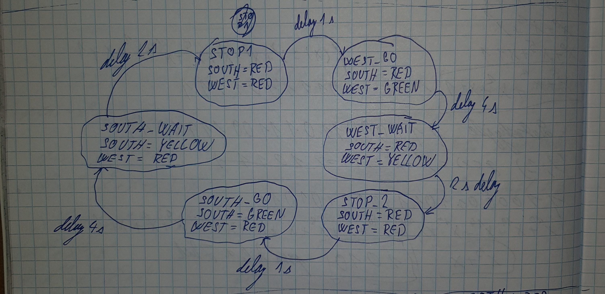
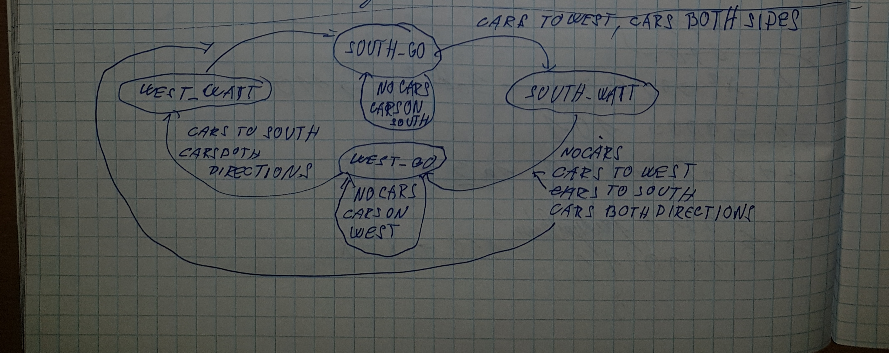

## Preparation tasks
| **Input P** | `0` | `0` | `1` | `1` | `0` | `1` | `0` | `1` | `1` | `1` | `1` | `0` | `0` | `1` | `1` | `1` |
| :-- | :-: | :-: | :-: | :-: | :-: | :-: | :-: | :-: | :-: | :-: | :-: | :-: | :-: | :-: | :-: | :-: |
| **Clock** | ↑ | ↑ | ↑ | ↑ | ↑ | ↑ | ↑ | ↑ | ↑ | ↑ | ↑ | ↑ | ↑ | ↑ | ↑ | ↑ |
| **State** | A | A | B | C | C | D | A | B | C | D | B | B | B | C | D | B |
| **Output R** | `0` | `0` | `0` | `0` | `0` | `1` | `0` | `0` | `0` | `1` | `0` | `0` | `0` | `0` | `1` | `0` |

| **LED** | **pin names R,G,B** | **Red** | **Yellow** | **Green** |
| :-: | :-: | :-: | :-: | :-: |
| LED16 | N15, M16, R12 | `1,0,0` | `1,1,0` | `0,1,0` |
| LED17 | N16, R11, G14 | `1,0,0` | `1,1,0` | `0,1,0` |

## Traffic light controller
### State diagram

### VHDL code of sequential process p_traffic_fsm
```VHDL
p_traffic_fsm : process(clk)
    begin
        if rising_edge(clk) then
            if (reset = '1') then       -- Synchronous reset
                s_state <= STOP1 ;      -- Set initial state
                s_cnt   <= c_ZERO;      -- Clear all bits

            elsif (s_en = '1') then
                -- Every 250 ms, CASE checks the value of the s_state 
                -- variable and changes to the next state according 
                -- to the delay value.
                case s_state is

                    -- If the current state is STOP1, then wait 1 sec
                    -- and move to the next GO_WAIT state.
                    when STOP1 =>
                        -- Count up to c_DELAY_1SEC
                        if (s_cnt < c_DELAY_1SEC) then
                            s_cnt <= s_cnt + 1;
                        else
                            -- Move to the next state
                            s_state <= WEST_GO;
                            -- Reset local counter value
                            s_cnt   <= c_ZERO;
                        end if;

                    when WEST_GO =>
                        -- WRITE YOUR CODE HERE
                         if (s_cnt < c_DELAY_4SEC) then
                            s_cnt <= s_cnt + 1;
                        else
                            s_state <= WEST_WAIT;
                            s_cnt   <= c_ZERO;
                        end if;

                    when WEST_WAIT =>
                         if (s_cnt < c_DELAY_2SEC) then
                            s_cnt <= s_cnt + 1;
                        else
                            s_state <= STOP2;
                            s_cnt   <= c_ZERO;
                        end if;
                        
                    when STOP2 =>
                         if (s_cnt < c_DELAY_1SEC) then
                            s_cnt <= s_cnt + 1;
                        else
                            s_state <= SOUTH_GO;
                            s_cnt   <= c_ZERO;
                        end if;
                        

                   when SOUTH_GO =>
                         if (s_cnt < c_DELAY_4SEC) then
                            s_cnt <= s_cnt + 1;
                        else
                            s_state <= SOUTH_WAIT;
                            s_cnt   <= c_ZERO;
                        end if;
                        
                   when SOUTH_WAIT =>
                         if (s_cnt < c_DELAY_2SEC) then
                            s_cnt <= s_cnt + 1;
                        else
                            s_state <= STOP1;
                            s_cnt   <= c_ZERO;
                        end if;

                    -- It is a good programming practice to use the 
                    -- OTHERS clause, even if all CASE choices have 
                    -- been made. 
                    when others =>
                        s_state <= STOP1;

                end case;
            end if; -- Synchronous reset
        end if; -- Rising edge
    end process p_traffic_fsm;
```
### VHDL code of combinatorial process p_output_fsm
```VHDL
 p_output_fsm : process(s_state)
    begin
        case s_state is
            when STOP1 =>
                south_o <= c_RED;   
                west_o  <= c_RED;   
            when WEST_GO =>
                -- WRITE YOUR CODE HERE
                south_o <= c_RED;  
                west_o  <= c_GREEN;
            when WEST_WAIT =>
                south_o <= c_RED;
                west_o  <= c_YELLOW;
            when STOP2 =>
                south_o <= c_RED;
                west_o  <= c_RED; 
            when SOUTH_GO =>
                south_o <= c_GREEN;
                west_o  <= c_RED;
           when SOUTH_WAIT =>
                south_o <= c_YELLOW;
                west_o  <= c_RED;                                           
             
            when others =>
                south_o <= c_RED;
                west_o  <= c_RED;
        end case;
    end process p_output_fsm;
```
### Simulation


### Smart controller
### State table
| **State name** | **Output SOUTH,WEST** | **NEXT STATE->** | **No cars** | **Cars west** | **Cars south** |**Cars on both sides** |  
| :-: | :-: | :-: | :-: | :-: | :-: | :-: |
| `SOUTH_GO` | `GREEN, RED` |  | `SOUTH_GO` | `SOUTH_WAIT` | `SOUTH_GO` | `SOUTH_WAIT` |
| `SOUTH_WAIT` | `YELLOW, RED` |  | `WEST_GO` | `WEST_GO` | `WEST_GO` | `WEST_GO` |
| `WEST_GO` | `RED, GREEN` |  | `WEST_GO` | `WEST_GO` | `WEST_WAIT` | `WEST_WAIT` |
| `WEST_WAIT` | `RED, YELLOW` |  | `SOUTH_GO` | `SOUTH_GO` | `SOUTH_GO` | `SOUTH_GO` |

### State diagram

### VHDL code of process p_smart_traffic_fsm
```VHDL
p_smart_traffic_fsm : process(clk)
    begin
        if rising_edge(clk) then
            if (reset = '1') then        -- Synchronous reset
                s_state <= SOUTH_GO;     -- Set initial state
                s_cnt   <= c_DELAY_ZERO; -- Clear all bits

            elsif (s_en = '1') then
                -- Every 250 ms, CASE checks the value of the s_state 
                -- variable and changes to the next state according 
                -- to the delay value.
                case s_state is

                    -- If the current state is STOP1, then wait 1 sec
                    -- and move to the next GO_WAIT state.
                    when SOUTH_GO =>
                        if (s_cnt < c_DELAY_3SEC) then
                            s_cnt <= s_cnt + 1;
                        else
                        if(sensor_i = "00" or sensor_i = "10") then
                        --no change
                        else
                            -- Move to the next state
                            s_state <= SOUTH_WAIT;
                            -- Reset local counter value
                            s_cnt   <= c_DELAY_ZERO;
                        end if;
                        end if;
                    when SOUTH_WAIT =>
                        if (s_cnt < c_DELAY_05SEC) then
                            s_cnt <= s_cnt + 1;
                        else
                            s_state <= WEST_GO;
                            s_cnt <= c_DELAY_ZERO;
                        end if;

                    when WEST_GO =>
                        if (s_cnt < c_DELAY_3SEC) then
                            s_cnt <= s_cnt + 1;
                        else
                        if (sensor_i = "00" or sensor_i = "01") then
                        --nothing
                        else
                            s_state <= WEST_WAIT;
                            s_cnt <= c_DELAY_ZERO;
                        end if;
                        end if;
                    when WEST_WAIT =>
                        if (s_cnt < c_DELAY_05SEC) then
                            s_cnt <= s_cnt + 1;
                        else
                            s_state <= SOUTH_GO;
                            s_cnt <= c_DELAY_ZERO;
                        end if;

                    -- It is a good programming practice to use the 
                    -- OTHERS clause, even if all CASE choices have 
                    -- been made. 
                    when others =>
                        s_state <= SOUTH_GO;

                end case;
            end if; -- Synchronous reset
        end if; -- Rising edge
    end process p_smart_traffic_fsm;
```